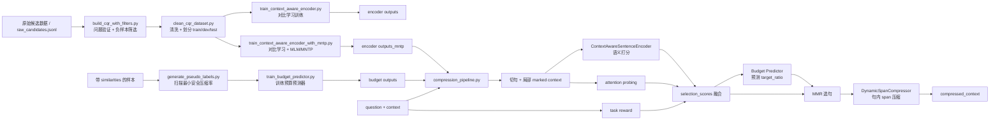
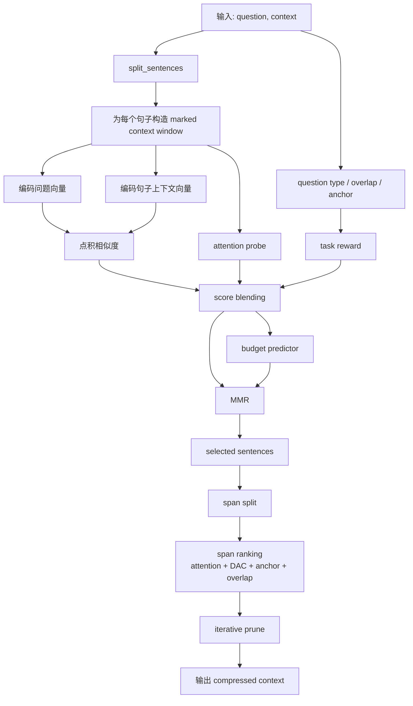

# 项目技术报告与论文创新点整理

## 1. 项目概述

本项目围绕长上下文问答场景中的上下文压缩展开，目标是在尽量保持答案质量的前提下，降低输入 token 数量、推理延迟和显存开销。

从代码实现看，系统不是单一的句子筛选器，而是一个两级压缩框架：

1. 一级压缩：基于上下文感知句子编码器，完成问题驱动的句子级选择。
2. 预算预测：根据问题复杂度、相似度分布和上下文结构，预测合适的压缩率。
3. 去冗余选择：在预算约束下使用 MMR 保留高相关、低冗余句子。
4. 二级压缩：对保留句进一步做句内 span 级压缩，删除低价值修饰片段。
5. 数据与训练：提供 CQR 风格数据构建、清洗、编码器训练和预算预测器训练脚本。

这意味着该项目已经不是单纯的 CPC 论文复现，而是一个“句子级压缩 + 学习式预算 + 句内动态裁剪”的增强版原型。

## 2. 论文可主打的核心创新点

严格说，这项工作的最有价值之处，不是单独发明了某一个全新的打分公式，而是把问题重新定义成了一个现有几类方法都没有完整覆盖的任务：

> 在黑盒 LLM 场景下，如何在句子级压缩之后，继续做任务对齐的句内可控压缩，同时保持答案相关语义和文本可读性。

对应到当前代码实现，这个创新落在以下几个关键位置：

- `pipeline/compression_pipeline.py`：把句子级打分、预算预测、MMR 选句和句内压缩串成统一主流程。
- `pipeline/task_aware_compression.py`：实现任务感知的句内 span 级压缩决策。
- `pipeline/dac_adapter.py`：把 DAC 风格的 token 显著性能力适配成句内压缩的辅助信号。

如果要概括成一句论文层面的贡献，可以写成：

> 提出一种面向黑盒 LLM 的层次化任务对齐上下文压缩框架，在问题感知的句子级压缩之后，进一步执行可控的句内 span 级压缩，以更低的 token 成本保持答案相关语义与文本可读性。

### 2.1 相比 DAC 的创新点

DAC 的本质是任务无关的单阶段 token 压缩，而本项目实现的是“句子级选择 + 句内 span 压缩”的两级压缩。

具体差异在于：

- DAC 解决的是“哪些 token 可以删”。
- 本项目解决的是“哪些句子应该先保留，以及在保留句中哪些短语删掉更安全”。
- DAC 更偏 token 级删减；本项目将压缩控制提升到 span 或 clause 级，更适合中文文本的可读性与语义稳定性。
- 本项目没有直接机械复现 task-agnostic token compressor，而是把 DAC 的 attention + loss 融合思想转化为任务感知的句内删减信号。

论文中可以把这一点描述为：

> 本文不是直接复现 token-level DAC，而是将其显著性思想迁移到层次化压缩框架中，作为任务感知句内 span 剪裁的辅助决策信号。

### 2.2 相比 TACO-RL 的创新点

TACO-RL 的核心优势是用强化学习直接对齐下游任务，但代价是训练成本高、工程复杂度高。

本项目保留了“任务对齐”的思想，但走的是轻量路线：

- 不依赖高成本 RL 训练。
- 把任务信号实现为轻量 `task reward`。
- 同一套任务信号同时用于句子级选择和句内压缩。
- 更适合在小数据、低算力和现有 CPC 工程上直接扩展。

论文里可以把这一点写成：

> 本文提出一种 lightweight task-aligned alternative，在不引入强化学习训练开销的前提下，将任务相关奖励同时注入句子选择与句内压缩阶段。

### 2.3 相比 Sentinel 的创新点

Sentinel 强调从模型注意力中读出“模型真正用到的内容”，注意力是其核心线索。

本项目没有把 attention 当成唯一标准，而是把它作为辅助信号，与其它信号一起融合：

- semantic relevance
- attention probe
- task reward
- DAC-style salience

因此，本项目不是单一的 attention readout，而是多信号压缩控制器。这种设计在问答场景里更稳，更容易兼顾答案保持与压缩率。

论文中可以这样表述：

> 本文提出一种多信号压缩决策机制，联合语义相关性、attention probing、任务奖励和 token/span 显著性进行压缩控制，而非依赖单一 attention 读出信号。

### 2.4 相比 Sentence-Anchored Gist Compression 的创新点

这类方法通常偏向模型内部 gist 表征或特定压缩表示，而本项目的输出仍然是自然语言文本。

这带来三个直接优势：

- 不需要引入额外 gist token。
- 不需要修改下游大模型结构。
- 压缩结果可以直接送给任意黑盒 LLM API。

同时，本项目借用了“句子或子句边界是稳定压缩锚点”的思想，但没有走模型结构改造路线，因此更偏工程实用型方案。

论文中可以概括为：

> 本文提出一种面向黑盒 LLM 的可读文本压缩范式，在不修改下游模型结构的条件下，利用句子与子句边界作为稳定压缩单元，进一步降低输入 token 开销。

### 2.5 需要诚实表述的定位

从学术定位看，这项工作的创新更像：

- 新的问题定义
- 新的层次化组合框架
- 面向中文与黑盒场景的工程落地

而不是单点式的理论突破。

这并不弱，但前提是实验必须证明：

- 比只做 CPC 句子级压缩更省 token。
- 比纯 DAC token 压缩更可读、更稳定。
- 比只看 attention probe 更稳。
- 各个模块不是简单堆叠，而是确实贡献了性能。

## 3. 每个 Python 文件的作用与工作原理

### 3.1 顶层脚本

| 文件 | 作用 | 工作原理 |
| --- | --- | --- |
| `main.py` | 项目最小可运行入口 | 实例化 `ContextAwareCompressor`，加载训练好的上下文感知编码器和预算预测器，对给定 `question + context` 执行两级压缩，并打印目标压缩率、句子分数、选中索引和二级压缩统计。 |
| `target_ratio.py` | 启发式压缩率估计 | 根据相似度分布集中度、高相关句比例和头部差距估计 `target_ratio`，是预算学习模块出现前的规则基线。 |
| `1.原理复现(LLM版).py` | 基于外部 LLM 的句子打分版基线 | 将长文本切句，逐句询问外部 LLM 与问题的相关度，再按预算保留高分句。 |
| `2.原理复现（向量嵌入.py` | 基于向量嵌入的句子检索版基线 | 使用 Hugging Face 向量模型编码问题和句子，按相似度排序并按预算截断，然后按原文顺序恢复文本。 |

### 3.2 `context_aware_encoder_model/`

| 文件 | 作用 | 工作原理 |
| --- | --- | --- |
| `context_aware_sentence_encoder.py` | 上下文感知句子编码器核心实现 | 给目标句添加 `<sent_start>` 和 `<sent_end>` 标记，把句子放回上下文中重新编码，抽取 marker 内的 hidden states 平均作为句子在上下文中的表示，再与问题向量做相似度计算。还实现 attention probing、对比学习损失和局部窗口构造。 |
| `train_context_aware_encoder.py` | 标准句子编码器训练脚本 | 读取 CQR 风格 JSONL 数据，构造正负 marked context，使用对比学习让 query 接近正样本句、远离负样本句。 |
| `train_context_aware_encoder_with_mntp.py` | 增强版多任务训练脚本 | 在对比学习之外加入 MLM/MNTP 近似目标，增强模型对上下文内部语言结构和局部依赖的建模能力。 |
| `__init__.py` | 包初始化文件 | 空文件，仅用于目录导入。 |

### 3.3 `data_builder/`

| 文件 | 作用 | 工作原理 |
| --- | --- | --- |
| `build_cqr_with_filters.py` | 构造 CQR 风格训练样本 | 先做问题验证，确保正样本句不能单独回答问题；再做相似度筛负样本，必要时加 KL 过滤，生成更干净的训练数据。 |
| `clean_cqr_dataset.py` | 清洗与划分数据集 | 检查字段完整性、句子数范围、正负句是否在原文中、负样本是否过度相关、正句是否泄露答案，并按上下文哈希划分 train/dev/test。 |

### 3.4 `pipeline/`

| 文件 | 作用 | 工作原理 |
| --- | --- | --- |
| `compression_pipeline.py` | 两级压缩总入口 | 先计算 `semantic_similarities`，再可选融合 `attention_probe_scores` 和 `task_rewards` 得到 `selection_scores`；若未指定压缩率，则调用预算预测器；随后在预算内使用 MMR 选句，并可选执行二级 span 压缩。 |
| `task_aware_compression.py` | 句内动态 span 压缩模块 | 将句子切成多个 span，综合问题类型、重叠度、任务锚点、attention probing、DAC 风格分数等信息，排序并删除最低价值 span，直到达到每句目标保留比例。 |
| `dac_adapter.py` | DAC 风格 token 显著性适配器 | 使用 MLM token loss 与注意力融合，计算 token 或 span 级重要性分数；当前主流程主要用它给 span 排序提供参考。 |
| `__init__.py` | 包初始化文件 | 空文件，仅用于目录导入。 |

### 3.5 `target_ratio_model/`

| 文件 | 作用 | 工作原理 |
| --- | --- | --- |
| `budget_features.py` | 预算预测特征工程 | 提取相似度统计、熵、top-k mass、句长统计、问题类型、实体数和多跳倾向等特征，并转为固定顺序向量。 |
| `budget_model.py` | 预算预测模型定义 | 使用 MLP 对离散压缩率 bucket 进行分类；`BudgetLoss` 对预算过小的预测附加惩罚。 |
| `example_integration.py` | 接入示例 | 展示如何在已有句子排序器上挂接学习式预算选择器。 |
| `generate_pseudo_labels.py` | 预算标签伪标注 | 扫描多个压缩率，找到在回答质量可接受前提下的最小安全压缩率，写入 `label_ratio`。 |
| `predict_budget.py` | 预算推理脚本 | 加载训练好的预算模型，对单条样本输出预测压缩率和 bucket 概率。 |
| `train_budget_predictor.py` | 预算训练脚本 | 读取带 `label_ratio` 的训练样本，提取特征后训练预算预测 MLP。 |
| `__init__.py` | 包初始化文件 | 空文件，仅用于目录导入。 |

## 4. 系统工作流程

### 4.1 推理流程

系统的在线压缩流程如下：

1. 输入 `question` 和原始 `context`。
2. 使用 `split_sentences` 完成切句。
3. 对每个句子构造局部 `marked context window`。
4. 编码器计算句子级语义相关性。
5. 可选计算 attention probing 分数。
6. 计算任务奖励 `task_rewards`。
7. 将多信号融合为 `selection_scores`。
8. 预算预测器输出 `target_ratio`。
9. 在预算内用 MMR 做句子选择。
10. 对保留句执行句内 span 压缩。
11. 输出压缩后的自然语言上下文。

### 4.2 数据与训练流程

完整训练链条如下：

1. 从原始候选数据出发。
2. 使用 `build_cqr_with_filters.py` 构造 CQR 风格样本。
3. 使用 `clean_cqr_dataset.py` 清洗并划分 train/dev/test。
4. 用清洗后的数据训练上下文感知编码器。
5. 用带 `similarities` 的样本扫描生成预算伪标签。
6. 训练预算预测器。
7. 在推理阶段把编码器、预算模型和二级压缩器统一接入主流程。

## 5. 项目运行方式

### 5.1 直接运行主流程

```bash
cd "D:\python_project\LittleEssay1\1 Prompt Compression with Context-Aware Sentence Encoding for Fast and"
python main.py
```

当前环境里，这条命令已经验证通过。一次实际运行结果表明：

- 预测压缩率为 `0.4`
- 一级压缩保留了 6 个句子
- 二级压缩额外删除了 2 个 span
- 主流程能够正常输出 `compressed_context`

### 5.2 训练句子编码器

```bash
python -m context_aware_encoder_model.train_context_aware_encoder --train_file context_aware_encoder_model/sample_cqr_train.jsonl --output_dir context_aware_encoder_model/outputs
```

### 5.3 训练增强版句子编码器

```bash
python -m context_aware_encoder_model.train_context_aware_encoder_with_mntp --train_file context_aware_encoder_model/sample_cqr_train.jsonl --output_dir context_aware_encoder_model/outputs_mntp
```

### 5.4 生成预算伪标签并训练预算预测器

```bash
python -m target_ratio_model.generate_pseudo_labels --input_jsonl target_ratio_model/sample_pseudolabel_input.jsonl --output_jsonl target_ratio_model/sample_pseudolabel_output.jsonl --answer_mode demo_extractive
python -m target_ratio_model.train_budget_predictor --train_file target_ratio_model/sample_budget_train.jsonl --output_dir target_ratio_model/outputs
```

### 5.5 预算预测推理

```bash
python -m target_ratio_model.predict_budget --model_dir target_ratio_model/outputs --input_json target_ratio_model/predict_input_example.json
```

### 5.6 构造与清洗训练数据

```bash
python -m data_builder.build_cqr_with_filters --input_jsonl data_builder/raw_candidates.jsonl --output_jsonl context_aware_encoder_model/cqr_filtered.jsonl --verification_mode heuristic
python -m data_builder.clean_cqr_dataset --input_glob "data_builder/*.jsonl" --output_dir data_builder/cleaned
```

## 6. 论文里建议重点强调的实验问题

如果这份工作要形成论文，实验部分最应该证明的是：

1. 同等 token budget 下，本方法比只做 CPC 句子级压缩保留更多答案相关信息。
2. 同等回答质量下，本方法比只做句子级压缩能进一步减少输入 token。
3. 相比纯 DAC token 压缩，本方法输出更可读、语义更稳定。
4. 去掉 `task reward`、`attention probe`、`DAC-guided span pruning` 任一模块，效果都会下降。

这几项实验会直接支撑“层次化任务对齐压缩框架”这一核心主张。

## 7. 可直接写进论文的贡献表述

可以将论文贡献写成以下三条：

1. 提出一种层次化任务对齐上下文压缩框架，先进行问题感知的句子级压缩，再进行 DAC 引导的句内 span 级压缩。
2. 提出一种多信号压缩决策机制，联合语义相关性、attention probing、任务奖励和 token 或 span 显著性进行压缩控制。
3. 提出一种面向黑盒 LLM 的可读文本压缩范式，在不修改下游模型结构的前提下进一步降低输入 token 开销。

## 8. 项目原理结构图

### 8.1 总体结构图



### 8.2 推理阶段细化图



## 9. 总结

本项目最强的价值不在于某个单独模块“特别新”，而在于把以下几件事组合成了一条完整路线：

- 用上下文感知句子编码器决定保留哪些句子。
- 用预算预测器决定应该保留多少内容。
- 用任务感知的 span 压缩决定保留句里还可以删什么。
- 最终仍然输出自然语言文本，可直接服务任意黑盒 LLM。

因此，这项工作非常适合被表述为：

> 一种面向黑盒 LLM 的层次化、任务对齐、可读文本上下文压缩框架。
